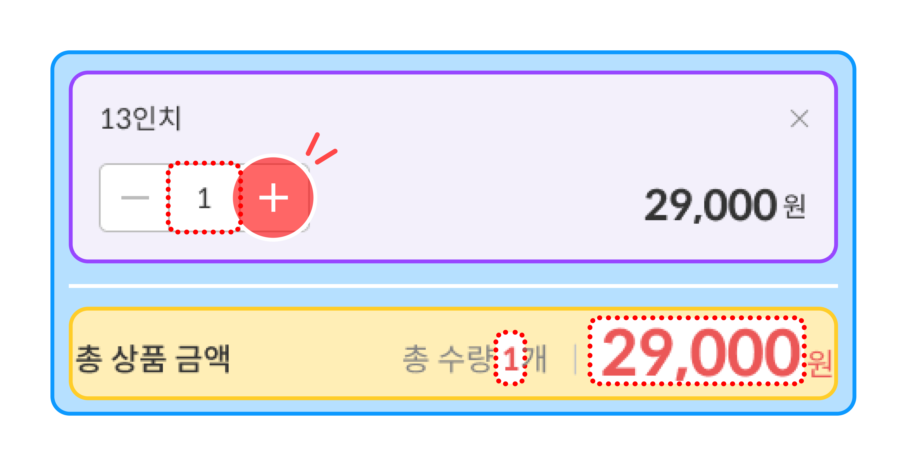
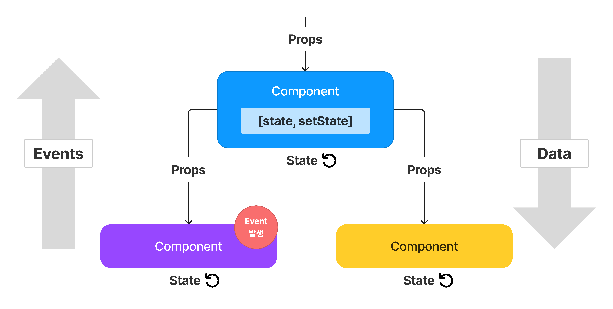

# State and Lifecycle(생명주기)


- State는 props와 유사하지만, 비공개이며 컴포넌트에 의해 완전히 제어됨.

## 함수에서 클래스로 변환하기

1. `React.Component`를 확장하는 동일한 이름의 ES6 class를 생성
2. `render()`라고 불리는 빈 메서드를 추가
3. 함수의 내용을 `render()` 메서드 안으로 옮김
4. `render()` 내용 안에 있는 props를 `this.props`로 변경
5. 남아있는 빈 함수 선언을 삭제

```js
class Clock extends React.Component {
  render() {
    return (
      <div>
        <h1>Hello, world!</h1>
        <h2>It is {this.props.date.toLocaleTimeString()}.</h2>
      </div>
    );
  }
}
```

## 클래스에 로컬 State 추가하기

```js
class Clock extends React.Component {
  constructor(props) {
    super(props);
    this.state = { date: new Date() };
  }

  render() {
    return (
      <div>
        <h1>Hello, world!</h1>
        <h2>It is {this.state.date.toLocaleTimeString()}.</h2>
      </div>
    );
  }
}

const root = ReactDOM.createRoot(document.getElementById("root"));
root.render(<Clock />);
```

## 생명주기 메서드를 클래스에 추가하기

- 마운팅
- 언마운팅

```js
class Clock extends React.Component {
  constructor(props) {
    super(props);
    this.state = { date: new Date() };
  }
  componentDidMount() {
    // 컴포넌트 출력물이 DOM에 렌더링 된 후에 실행
    this.timerID = setInterval(() => this.tick(), 1000);
  }
  componentWillUnmount() {
    clearInterval(this.timerID);
  }

  tick() {
    this.setState({
      date: new Date(),
    });
  }

  render() {
    return (
      <div>
        <h1>Hello, world!</h1>
        <h2>It is {this.state.date.toLocaleTimeString()}.</h2>
      </div>
    );
  }
}

const root = ReactDOM.createRoot(document.getElementById("root"));
root.render(<Clock />);
```

1. `<Clock />`가 `root.render()`로 전달되었을 때 React는 Clock 컴포넌트의 constructor를 호출.

- Clock이 현재 시각을 표시해야 하기 때문에 현재 시각이 포함된 객체로 `this.state`를 초기화. 나중에 이 state를 업데이트할 예정

2. React는 Clock 컴포넌트의 `render()` 메서드를 호출.

- 이를 통해 React는 화면에 표시되어야 할 내용을 알게됨.
- 그다음 React는 Clock의 렌더링 출력값을 일치시키기 위해 DOM을 업데이트

3. Clock 출력값이 DOM에 삽입되면, React는 `componentDidMount()` 생명주기 메서드를 호출.

- 그 안에서 Clock 컴포넌트는 매초 컴포넌트의 `tick()` 메서드를 호출하기 위한 타이머를 설정하도록 브라우저에 요청

4. 매초 브라우저가 `tick()` 메서드 호출.

- 그 안에서 Clock 컴포넌트는 `setState()`에 현재 시각을 포함하는 객체를 호출하면서 UI 업데이트
- `setState()` 호출 덕분에 React는 state가 변경된것을 인지하고 화면에 표시될 내용을 알아내기 위해 `render()` 메서드 다시 호출
- 이 때 `render()` 메서드 안의 this.state.date가 달라지고 렌더링 출력값은 업데이트된 시각을 포함.
- React는 이에 따라 DOM을 업데이트

5. Clock 컴포넌트가 DOM으로부터 한번이라도 삭제된 적이 있다면 React는 타이머를 멈추기 위해 `componentWillUnmount()` 생명주기 메서드를 호출

## State 올바르게 사용하기

### 직접 State 수정 X

- 대신 setState() 사용

### State 업데이트는 비동기적일 수도 있음.

- React는 성능을 위해 여러 setState() 호출을 단일 업데이트로 한꺼번에 처리할 수 있음.
- this.props와 this.state가 비동기적으로 업데이트될 수 있기 때문에 다음 state를 계산할 때 해당 값에 의존해서는 안됨.

```js
// Wrong
this.setState({
  counter: this.state.counter + this.props.increment,
});
```

```js
// Correct
this.setState((state, props) => ({
  counter: state.counter + props.increment,
}));
```

- 이전 state를 첫번째 인자로 받아들일 것이고, 업데이트가 적용된 시점의 props를 두번째 인자로 받아들일 것임.

### State 업데이트는 병합됨

- 병합은 얕게 이루어짐.

```js
constructor(props) {
  super(props);
  this.state = {
    posts: [],
    comments: []
  };
}
componentDidMount() {
  fetchComments().then(response => {
    this.setState({
      comments: response.comments
    });
  });
}
```

- post에 영샹을 주지 않고, comments만 완전히 대체

## 데이터는 아래로 흐릅니다

- state는 종종 로컬 또는 캡슐화라고 불림.
- state가 소유하고 설정한 컴포넌트 이외에는 어떠한 컴포넌트에도 접근할 수 없음.
- 컴포넌트는 자신의 state를 자식 컴포넌트에 props로 전달할 수 있음.
- 하위 컴포넌트는 props로 받은 정보가 상위 컴포넌트에서 state로 왔는지, props에서 왔는지, 수동으로 입력한 것인지 알지 못함.
- 하향식(top-down), 단방향식 데이터 흐름
- 모든 state는 항상 특정한 컴포넌트가 소유하고 있으며 그 state로부터 파생된 UI 또는 데이터는 오직 트리구조에서 자신의 "아래"에 있는 컴포넌트에 영향을 미침



